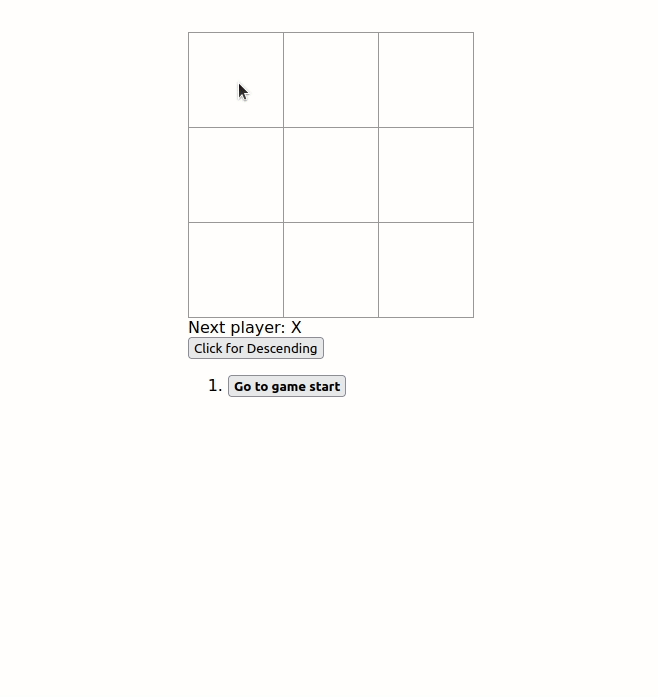

# React Tic-Tac-Toe

## Tutorial Extensions

Learning and getting better at react with the tutorial project at [Tutorial](https://reactjs.org/tutorial/tutorial.html) and its recommended extensions:

1. Display the location for each move in the format (col, row) in the move history list.
2. Bold the currently selected item in the move list.
3. Rewrite Board to use two loops to make the squares instead of hardcoding them.
4. Add a toggle button that lets you sort the moves in either ascending or descending order.
5. When someone wins, highlight the three squares that caused the win.
6. When no one wins, display a message about the result being a draw.
